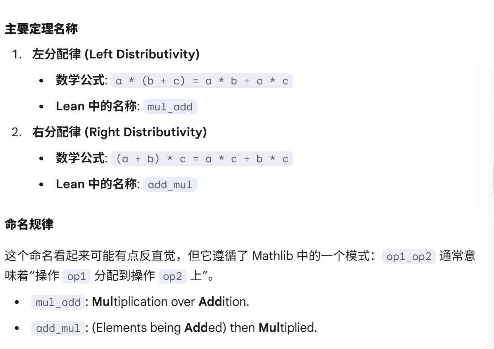

# 7. Structures

现代数学广泛使用了代数结构，这些代数结构封装了可在不同环境中实例化的模式，而且往往有多种方法对它们进行定义和实例化。

因此，Lean 提供了相应的方法来形式化定义这些结构并对其进行操作。

本章解释之前出现过的方括号语法，比如 `[Ring α]`、`[Lattice α]` ，并介绍如何创建并使用自定义的代数结构

## 7.1 定义结构体

广义上说，结构体是对**特定形式数据集合**的约定，包括包含**数据的形式**以及这些数据要**满足的一些约束条件**。
``` lean
@[ext]
structure Point where
  x : ℝ
  y : ℝ
  z : ℝ
```

上面的 `@[ext]` 注解让 Lean 自动生成一个定理，内容是当该结构体的两个实例的**组成部分对应相同**时，这两个实例**相等**。该属性也成为**外延性（extensionality）**

```
example (a b : Point) (hx : a.x = b.x) (hy : a.y = b.y) (hz : a.z = b.z) : a = b := by
  ext
  repeat' assumption
```
> `repeat'` 是 `repeat` 策略的一个变体，它的作用是 **重复应用一个策略直到目标没有变化**。 `repeat` 策略是 **重复应用一个策略直到策略失败**。区别在于策略可以成功应用但目标没有改变，推荐使用 `repeat'`。


实例化 `Point` 的不同方法：
```
def myPoint1 : Point where
  x := 2
  y := -1
  z := 4

def myPoint2 : Point :=
  ⟨2, -1, 4⟩

def myPoint3 :=
  Point.mk 2 (-1) 4
```
其中定义 `myPoint3` 时用到函数 `Point.mk` 叫做 `Point` 结构体的构造函数（constructor），用于构造结构体成员。也可以为构造函数指定一个不同的名字，比如 `build`。
```
structure Point' where build ::
  x : ℝ
  y : ℝ
  z : ℝ

#check Point'.build 2 (-1) 4
```

接下来两个例子展示了如何定义结构体的函数。
``` lean
namespace Point   --- 不打开命名空间，需要写完整名称

def add (a b : Point) : Point :=
  ⟨a.x + b.x, a.y + b.y, a.z + b.z⟩

def add' (a b : Point) : Point where
  x := a.x + b.x
  y := a.y + b.y
  z := a.z + b.z

#check add myPoint1 myPoint2
#check myPoint1.add myPoint2

end Point
```
> 匿名投影记号（Anonymous Projection Notation）是一种语法糖，允许在不明确提及结构体类型名称的情况下，访问或 “投影” 结构体实例的字段。例如用 `a.add b` 代替 `Point.add a b`

接下来继续在相关命名空间添加定义，但在引用的代码片段中省略开关命名空间的相关指令。
```
protected theorem add_comm (a b : Point) : add a b = add b a := by
  rw [add, add]
  ext <;> dsimp
  repeat' apply add_comm

example (a b : Point) : add a b = add b a := by simp [add, add_comm]
```
> `dsimp` 是一种策略，用于进行**定义性化简（definitional simplification）**。它的核心作用是**展开定义**，将表达式中符合 **“定义性相等”** 的部分进行替换，但**不会**使用任何定理或重写规则来 “证明” 相等。
>
> `protected` 是一个关键字，用于**限制对某个名称的访问**，使其名称不会被自动加入到根命名空间中。核心作用为：一个被标记为 `proteted` 的定义，只有在**打开其所在的命名空间**或者**使用完整的名称**时才能被访问。
>
> 在一个定义上加上 `@[simp]`，使用 `simp` 策略就会自动简化它。
>
> 在 Mathlib 中，乘法对加法的分配律区分**左分配律**和**右分配律**



目前还没有方法将 `Point.add` 与泛型的 `+` 符号联系起来，抑或是将 `Point.add_comm`、`Point.add_assoc` 与泛型 `add+comm`、`add_assoc` 定理联系起来。这些属于结构体在代数层面的应用，下一节介绍如何具体实现，现在只需把结构体视为一种**捆绑对象和信息**的方法。

在结构体中除了可以指定**数据类型**，还可以指定数据需要**满足的约束**。在 Lean 中，后者被表示为**类型 `Prop` 的字段**。例如，标准 2-单纯性（standard 2-simplex）定义为满足 $x \geq 0, y \geq 0, z \geq 0, x+y+z=1$
``` lean
structure StandardTwoSimplex where
  x : ℝ
  y : ℝ
  z : ℝ
  x_nonneg : 0 ≤ x   
  y_nonneg : 0 ≤ y
  z_nonneg : 0 ≤ z
  sum_eq : x + y + z = 1
```
我们可以定义一个从 2-单纯性到其自身的映射，该映射交换 `x` 和 `y`：
``` lean
def swapXy (a : StandardTwoSimplex) : StandardTwoSimplex
    where
  x := a.y
  y := a.x
  z := a.z
  x_nonneg := a.y_nonneg   ---- 必须证明结构体满足性质
  y_nonneg := a.x_nonneg
  z_nonneg := a.z_nonneg
  sum_eq := by rw [add_comm a.y a.x, a.sum_eq]
```

先对 `noncomputable` 的简要介绍：

`noncomputable` 告诉 Lean，这个定义是纯粹**理论性**的，用于逻辑推理和证明。清补要尝试为它生成可执行代码，直接在逻辑上接受它即可。
  - 用途：当定义了一个依赖不可计算操作的函数或指，必须要用 `noncomputable` 关键字来标记它
> 可计算（Computable）: 一个定义是 “可计算的”，意味着 Lean 可以将其编译称一个具体的、可执行的算法
>
> 不可计算（Non-Computable）：一个定义是 “不可计算的”，意味着它依赖于**非构造性**的数学公理（如选择公理、排中律），这些公理断言了某事物的 “存在性”，但没有提供以一个通用的 “构造方法” 或算法。

``` lean
noncomputable section

def midpoint (a b : StandardTwoSimplex) : StandardTwoSimplex
    where
  x := (a.x + b.x) / 2
  y := (a.y + b.y) / 2
  z := (a.z + b.z) / 2
  x_nonneg := div_nonneg (add_nonneg a.x_nonneg b.x_nonneg) (by norm_num)
  y_nonneg := div_nonneg (add_nonneg a.y_nonneg b.y_nonneg) (by norm_num)
  z_nonneg := div_nonneg (add_nonneg a.z_nonneg b.z_nonneg) (by norm_num)
  sum_eq := by field_simp; linarith [a.sum_eq, b.sum_eq]
```
> `div_nonneg` 是一个定理，用来证明**两个非负数相除的结果也是非负的**
>
> `add_nonneg` 是一个定理，用来证明**两个非负数相加的结果仍然是非负的**
>
> `add_assoc` 是一个定理，用来证明**加法交换律**
> 
> `field_simp` 是一个策略，专门用于**化简包含分数（除法）的表达式**。主要工作是通分、约分以及将表达式整理成一个单一的最简分式。
>
> 注意，`field_simp` 需要确保分母不为零，因此它可能会产生形如 `b ≠ 0` 的新子目标，可通过提供确保相应假设来解决这些子目标，如 `field_simp [hb]`
>
> `by norm_num` 是一个策略，是 "Noemalize Numbers" 的缩写，它是 Lean 内置的超级计算机，用于计算和证明关于具体数字（没有变量）的表达式。不仅能得出结果，还能完成对计算结果的证明。
> 
> `linarith` 是 "Linear Arithmetic" 的缩写，是一个策略，专门用于自动**证明线性不等式**。它能处理的目标和假设只包含变量的加、减、以及和常数的乘法，但不能有变量与变量相乘。它可以直接推导出目标，或者找到矛盾进而证明任何结论。
>
> Lean 证明还没有那么智能，有时不能由策略直接证明，可先写出要证明的目标，再应用策略去证明

结构体还可以依赖于参数。例如，可以将标准 2- 单纯形推广到任意维数 n 下的 n- 单纯形。目前只需知道 `Fin n` 有 n 个元素，并且 Lean 知道如何在其上进行求和操作

`Fin` 是 `finite` 缩写，`Fin n` 类型代表一个包含 `n` 个元素的**有限**集合。一个 `Fin n` 类型的值，内部包含两个部分，分别是**一个数值**和**一个证明**

```
open BigOperators

structure StandardSimplex (n : ℕ) where
  V : Fin n → ℝ
  NonNeg : ∀ i : Fin n, 0 ≤ V i
  sum_eq_one : (∑ i, V i) = 1

namespace StandardSimplex

def midpoint (n : ℕ) (a b : StandardSimplex n) : StandardSimplex n
    where
  V i := (a.V i + b.V i) / 2
  NonNeg := by
    intro i
    apply div_nonneg
    · linarith [a.NonNeg i, b.NonNeg i]
    norm_num
  sum_eq_one := by
    simp [div_eq_mul_inv, ← Finset.sum_mul, Finset.sum_add_distrib,
      a.sum_eq_one, b.sum_eq_one]
    field_simp

end StandardSimplex
```
> `open BigOperators`：打开一个名为 `BigOperators` 的命名空间，使得能直接使用**求和 (∑)(\sum)、求积 (∏)(\prod) 等大型数学运算符的符号和相关定理**。

## 7.2 代数结构


## 7.3 构建高斯整数


## 


