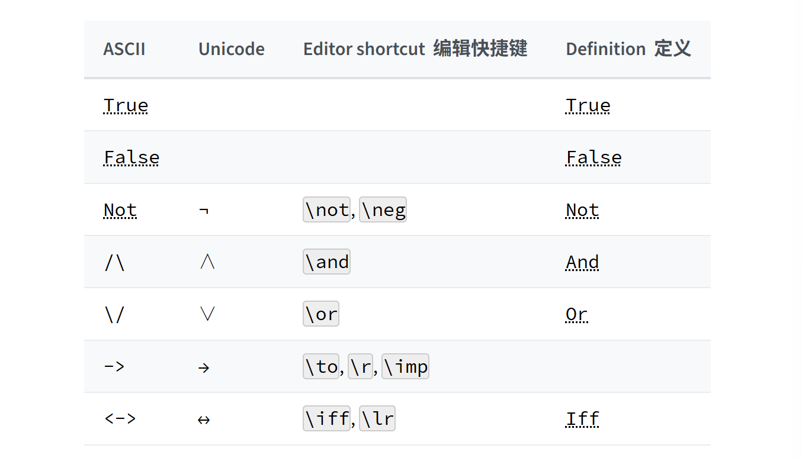

# Propositions and Proofs

本章解释如何使用依赖类型理论的语言来编写数学断言和证明。

## 3.1 Propositions as Types

依赖类型论：能在同一个通用框架中表示断言和证明。

> 构造器（constructor）：一个用来创建或构造某种数据类型实例的特殊函数或原始操作。
>
> 语法糖（Syntactic Sugar）：在编程语言中，提供一种更简洁、更易于人类读写的语法，而这种语法在底层会被 “翻译” 成一种更基础、更冗长的形式。
>
> 如在 Lean 中，句法糖：`p → q` 底层形式为：`Implies p q`

在自然演绎的证明系统中，关于 “蕴含” 的规则，与函数中关于 “抽象”（函数定义）和 “应用”（函数调用）的规则完全对应，这是 **柯里-霍华德同构（Curry-Howard Isomorphism）** 的一个实例，该理论有时也称为 **命题即类型（Propositions-as-Types）** 的范式。事实上，`Prop` 类型只是 `Sort 0` 的语法糖，`Sort 0` 是类型层级的最底层。且 `Type u` 也仅仅是 `Sort (u+1)` 的语法糖。Prop 有一些特殊性质（如类型无关性），但它也在箭头构造下是封闭的：若有 `p q : Prop`，那么 `p → q` 类型也是 `Prop`

Lean 中可将 Proof p 和 p 本身等同来避免重复编写项 Proof。即每当有 p : Prop 时，可将 p 解释为类型，即证明的类型。然后将 `t: p` 读作断言 t 是 p 的证明。

柯里-霍华德同构是核心思想，依赖构造演算是以此为基础功能更丰富的类型论系统，Lean 是基于 CIC 开发出来的具体的软件。

对于每个命题 p，将 p 关联一个类型，若 p 为假，则该类型为空；若 p 为真，则该类型有一个元素。在后种情形，说（与 p 关联的）类型是可被实例化的

若 p : Prop 是 Lean 中任何命题，Lean 核心将任何两个元素 `t1 t2 : p` 是为定义上相等，这被称为证明无关性。

在依赖类型论语言中形式地表达一个数学断言，需要展示一个项 `p : Prop`。要证明这个断言，需要展示一个项 `t : p`。Lean 作为证明助手，任务是帮助我们构建这样一个项 t，并验证它具有正确地形式和类型。

## 3.2 Working with Propositions as Types

在 “命题即类型” 的范式中，只涉及到 `→`（蕴含）的定理，可使用 lambda 抽象和应用来证明。在 Lean 中，`theorem` 命令用来引入一个新定理。 

> `set_option linter.unusedVaribales false` 作用为关闭 Lean 环境中 “未使用的变量” 这条代码检查规则。
>
> linter : 代码检查器，静态分析源代码，找出潜在的错误、不规范的写法、或者可疑的代码。

`theorem` 命令实际是 `def` 命令的一个版本：在 “命题即类型” 的对应关系下，证明定理 `p → q → p` 与定义其关联类型的一个元素是完全相同的。对于 Lean 内核类型检查其而言，这两者无任何区别。

此外，在一个定义的**函数体**中被引用的 `section` 变量，会被自动添加为该定义的参数；但是，只有在一个定理的**类型**中被引用的变量，才会被添加为该定理的参数。因为一个陈述被证明的方式，不应该影响那个正在被证明的陈述本身。

#print 是 Lean 中探查命令（introspection command），主要作用是显示一个给定标识符（如一个定理、一个定义、一个类型等）的完整定义或声明。
> 
> #print 显示定义，返回完整的定义代码
>
> #check 检查类型，返回类型

``` lean
variable {p : Prop}
variable {q : Prop}

theorem t1 : p → q → p := fun hp : p => fun hq : q => hp
theorem t1 : p → q → p :=
  fun hp : p =>
  fun hq : q =>
  show p from hp
```
`show` 的作用是在证明的一个特定位置，明确地声明当前要证明的目标是什么，然后再提供这个目标的证明。
- 通用语法：`show <目标类型> from <该目标的证明>`
- 
- 注意：`show` 命令出来标注类型外别无他用，内部 t1 上述两种表示方式都产生相同的项。但添加这些额外信息可提高证明的清晰度，并在书写证明时帮助检测错误。


和普通定义一样，可将 lambda 抽象的变量移到冒号的左边：   
`theorem t1 (hp : p) (hq : q) : p := hp`               
从 lambda 抽象风格改为函数风格。

可以将定理当成一个函数用：
``` lean
theorem t1 (hp : p) (hq : q) : p := hp

axiom hp : p   -- 等于声明 p 为真

theorem t2 : q → p := t1 hp
```

`axiom` 允许向 Lean 的环境中添加一个**断言为真、但没有提供构造性证明**的命题。
- 语法： `axiom <公理的名字> : <命题>`
- 注意： `axiom` 风险在于会破坏系统的可靠性。Lean 的核心经过精心设计，保证了只要不使用 `axiom`，就不可能在系统中证明出矛盾。

> 健全（unsound）: 在逻辑学中，一个形式系统被称为是健全的（sound），如果它保证系统内所有能够被证明的命题都是真的。

```lean
theorem t1 : ∀ {p q : Prop}, p → q → p :=
  fun {p q : Prop} (hp : p) (hq : q) => hp

variable {p q : Prop}
theorem t1 : p → q → p := fun (hp : p) (hq : q) => hp
```
上下两种写法等价，尽管 p 和 q 已被声明为变量，Lean 会自动对其进行泛化。

注意，对于假设，经常使用 Unicode 下标很有用，在 vscode 中下表通过 `\` + 数字来输入 ： `h\1` → `h₁`

## 3.3 Propositional Logic

Lean 定义了所有标准逻辑连接词和符号，命题连接词的符号如下：



这些逻辑联结词，无论输入（参数）还是输出（结果），都属于 `Prop` 类型。

运算顺序是：
` 一元否定 ¬ 结合力最强，其次是 ∧ ，然后是 ∨ ，接着是 → ，最后是 ↔ 。`

lambda 抽象可看作是 `→` 的一个 “**引入规则**”。在命题逻辑设定下，它展示了如何 “引入” 或建立一个蕴含。函数应用可看作是一个 “**消除规则**”，它展示了如何在证明中 “消除” 或使用一个蕴含。

什么是引入规则和消除规则？

- 引入规则（Introduction Rule）：指的是如何构建或 “引入” 一个包含该联结词的更复杂的命题，对 `→` 来说，如何得到一个 `A → B` 的命题？

- 消除规则（Elimination Rule）：指的是如何使用一个包含该联结词的命题来推导出更简单的信息，对 `→` 来说，已有 `A → B`，能用来干什么？

其他命题联结词在 Lean 库中定义好了，并且会被自动导入，每一种联结词都带有其典型的引入和消除规则。

### 3.3.1 Conjunction 合取 

`And.intro` ：合取 `∧` 的引入规则。`And.intro : p → q → p ∧ q`

`example` 命令陈述一个定理，但不会为其命名或将其存储在永久的上下文中。本质上，它只是检查给定的项是否具有指定的类型。但它用于举例说明很方便。

> 注：`theorem` 会定义一个有名的、可以被永久存储和后续引用的定理。

``` lean
variable (p q : Prop)
example (hp : p) (hq : q) : p ∧ q := And.intro hp hq
#check fun (hp : p) (hq : q) => And.intro hp hq
| fun hp hq => ⟨hp, hq⟩ : p → q → p ∧ q
```

表达式 `And.left h` 从一个 `h : p ∧ q` 的证明中创建一个 `p` 的证明。类似地，`And.right h` 是一个 `q` 的证明，通常称为左、右合取消除规则（and-elimination）。

注意：

- 合取引入（add-introduction）和合取消除（and-elimination），类似于笛卡尔积的配对（pairing）与投影（projection）操作。

- 区别在于，给定 `hp : p` 和 `hq : q`，`And.intro hp hq` 的类型是 `p ∧ q : Prop`；而给定 `a : α` 和 `b : β`，`Prod.mk a b` 的类型是 `α × β : Type`。`Prod` 不能用于 `Prop`，而 `And` 也不能用于 `Type`。

- `∧` 和 `×` 之间的相似性是柯里-霍华德同构的另一个实例，但与蕴含和函数空间构造器不同，`∧` 和 `×` 在 lean 中被分开处理。

- Lean 中某些类型**结构**（structures），该类型是通过一个单一的、规范的构造子（single canonical constructor）来定义的。该构造子从一系列合适的参数中构建出该类型的一个元素。

- 在上述情况下，当相关类型是一个归纳类型且可以从上下文推断出来时，Lean 允许使用**匿名构造子（anonymous constructor）** 表示，如 `⟨hp, hq⟩` 来代替 `And.intro hp hq` 

  - 尖括号 `⟨  ⟩` 分别通入 `\<` 和 `\>` 获得。

Lean 提供一个有用的语法工具 --- 点表示法（一种语法糖），允许将一个普通函数调用 `Namespace.function argument`，写成类似面向对象语言中的方法调用 `argument.function`，即 `表达式.函数名` 会被 Lean 翻译为 `类型名.函数名 表达式`。提供了一种无需打开命名空间（namespace）就能访问函数的方法。

``` lean
variable (xs : List Nat)
# check List.length xs
| xs.length : Nat

# check xs.length
| xs.length : Nat
```

即根据 `h : p ∧ q` 可将 `And.left h` 写为 `h.left`，将 `And.right` 写为 `h.right`

Lean 允许展平右结合的嵌套构造器，下面两个证明等价：
```
variable (p q : Prop)

example (h : p ∧ q) : q ∧ p ∧ q :=
  ⟨h.right, ⟨h.left, h.right⟩⟩

example (h : p ∧ q) : q ∧ p ∧ q :=
  ⟨h.right, h.left, h.right⟩
```

### 3.3.2  Disjunction 析取

**left and right or-introduction rules**：表达式 `Or.intro_left q hp` 从证明 `hp : p` 创建 `p ∨ q` 的证明。类似地，`Or.intro_right p hq` 使用证明 `hq : q` 为 `p ∨ q` 创建证明。 
> `Or.intro_left 右边的命题（q : Prop）  左边命题的证明（hp : p）`
>
> `Or.intro_right 左边的命题 右边命题的证明`

``` lean
variable (p q : Prop)
example (hp : p) : p ∨ q := Or.intro_left q hp
example (hq : q) : p ∨ q := Or.intro_right p hq
```

**Elimination rules**：通过证明 `r` 能从 `p` 得出并且 `r` 也能从 `q` 得出，从而证明 `r` 可以从 `p ∨ q` 得出。相当于一种**分类讨论**证明。

在表达式 `Or.elim hpq hpr hqr` 中，`Or.elim` 接受三个参数：`hpq : p ∨ q`、`hpr : p → r` 和 `hqr : q → r`，并产生一个 `r` 的证明。

```
variable (p q r : Prop)
example (h : p ∨ q) : q ∨ p :=
  Or.elim h
    (fun hp : p =>
        show q ∨ p from Or.intro_right q hp)
    (fun hq : q =>
        show q ∨ p from Or.intro_left p hq)
```
 
大多数情况下，`Or.intro_right` 和 `Or.intro_left` 的第一个参数可以被 Lean 自动推断，所以 Lean 提供了 `Or.inr` 和 `Or.inl` 可视为 `Or.intro_right _` 和 `Or.intro_left _` 的简写，上述证明可写为：

```
variable (p q r : Prop)
example (h : p ∨ q) : q ∨ p :=
  Or.elim h (fun hp => Or.inr hp) (fun hq => Or.inl hq)
```

`Or` 有两个构造函数，不能使用匿名构造函数表示法。但仍可以写 `h.elim` 而不是 `Or.elim h`:

```
variable (p q r : Prop)
example (h : p ∨ q) : q ∨ p :=
  h.elim (fun hp => Or.inr hp) (fun hq => Or.inl hq)
```

### 3.3.3 Negation and Falsity 否定和虚假

否定 `¬p`，实际上定义为 `p → False`，所以通过从 `p` 推到出一个矛盾来得到 `¬p` 的证明。

### 3.3.4 Logical Equivalence 逻辑等价


## 3.4 Introducing Auxiliary Subgoals


## 3.5 Examples if Propositional Validities


 

