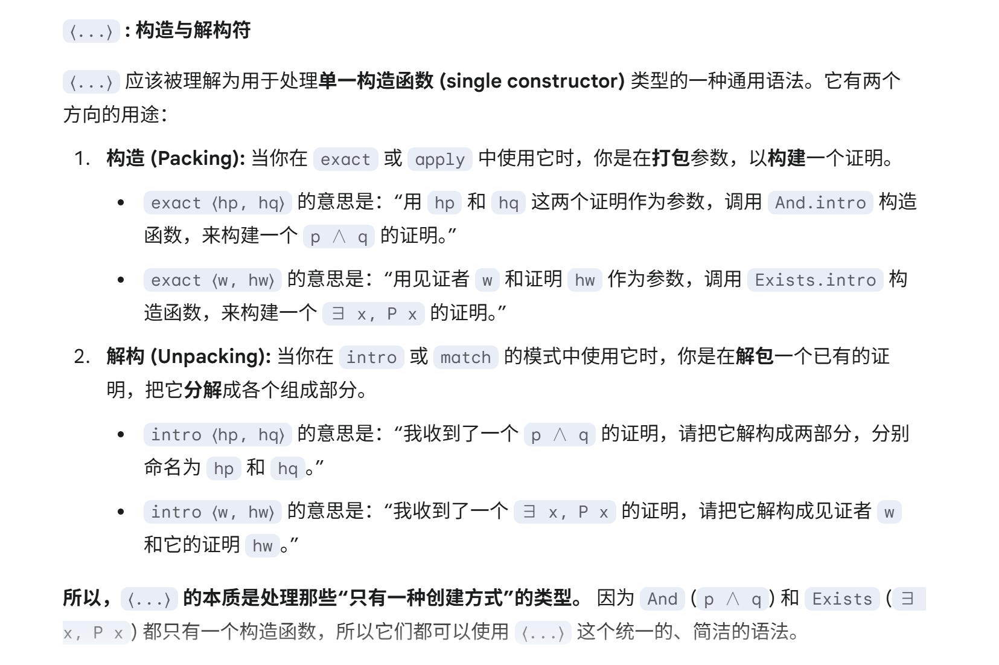

# Quantifiers and Equality

本章将逻辑构造的范围扩展到包括全称量词、存在量词和等价关系。

## 4.1 The Universal Quantifier 全称量词

**全称量词**：`∀ x : a, p x` 表示 “对每一个 `x : a`, `p x` 都成立”，是 `Forall (fun x : α => p x)`。在自然演绎系统中，与命题联结词一样，“任意”（forall）也是由一条引入规则和一条消去规则来支配。

非形式化讲，**引入规则**陈述如下：在一个 `x : a` 是任意的上下文中，如果我们有一个 `p x` 的证明，那就得到了 `∀ x : a, p x` 的一个证明。

**消除规则**陈述如下：给定一个 `∀ x : a, p x`的证明，以及任意一个类型为 `a` 的项 `t`，能获得一个 `p t` 的证明

可以将命题之间的蕴含 `p → q` 视为 `∀ x : p, q` 的特殊情况，其中表达式 `q` 不依赖于 `x`。

作为一个书写惯例，我们默认给予全称量词尽可能宽的作用范围。因此，在像 (∀ x : α, p x) → q 这样的例子中，必须使用括号来将量词 ∀ x 的作用范围限制在蕴涵（→）的假设部分（即左边的部分）。

尽管绑定变量的命名不同，但表达式仍被视为等价。因此，可以在假设和结论中使用相同的变量 x，并在证明中用不同的变量 z 对其进行实例化：
``` lean
example (α : Type) (p q : α → Prop) :
    (∀ x : α, p x ∧ q x) → ∀ x : α, p x :=
  fun h : ∀ x : α, p x ∧ q x =>
  fun z : α =>
  show p z from And.left (h z)
```

`Prop` 在类型宇宙的特殊规则：只要一个函数返回的是 `Prop`，那么无论输入类型 `a` 的宇宙层级有多高，这个函数类型本身永远都只在 `Prop`(`Sort 0`)级别。

`Prop` 上述的特殊规则，被称为非全称性（Imprediactivity）。即一个定义是非全称的，如果它通过一个包含了该定义物本身的集合来定义该事物。因为 `Prop` 被看作纯粹的逻辑问题只关心真假，所以不会导致罗素悖论。

## 4.2 Equality 相等

在 chapter7 Inductive types 解释如何从 Lean 的逻辑框架的基本原理定义 equality。这里将解释如何使用 equality。

等价的基本关系：

- `Eq.refl` 等于的自反性（Reflexivity）

  - 类型签名：`Eq.refl {α : Sort u}(a : α) : a = a`
  - 函数 `Eq.refl` 接受参数 a，返回 `a = a` 的证明

- `Eq.symm` 等于的对称性（Symmetry）

  - 类型签名：`Eq.symm {α : Sort u} {a b : α} (h : a = b) b = a`
  - 函数 `Eq.symm` 接受证明作为参数，返回等式的反转
 
- `Eq.trans` 等于的传递性（Transitivity）

  - 类型签名：`(Eq.trans {α : Sort u} {a b c : α} (h1 : a = b) (h2 : b = c) : a = c)`
  - 函数 `Eq.trans` 接受两个证明作为参数的函数，把两个证明做连接起来

``` lean
variable (α : Type) (a b c d : α)
variable (hab : a = b) (hcb : c = b) (hcd : c = d)

example : a = d :=
  Eq.trans (Eq.trans hab (Eq.symm hcb)) hcd
```
上述过程也可使用点表示法：
``` lean
example : a = d := (hab.trans hcb.symm).trans hcd
```

自反性（Reflexivity）比其看起来更有用。因为在构造演算（Calculus of Construction）中，项（terms）具有计算性解释，且该逻辑框架将具有**共同规约形式**（common reduct）的项时为相同。所以，一些非平凡等式可通过自反性来证明：
``` lean
variable (α β : Type)

example (f : α → β) (a : α) : (fun x => f x) a = f a := Eq.refl _
example (a : α) (b : β) : (a, b).1 = a := Eq.refl _
example : 2 + 3 = 5 := Eq.refl _
```

该框架的这个特性非常重要，所以库中定义了符号 `rfl` 来表示 `Eq.refl _`

``` lean
example (f : α → β) (a : α) : (fun x => f x) a = f a := rfl
example (a : α) (b : β) : (a, b).1 = a := rfl
example : 2 + 3 = 5 := rfl
```

由于每个断言都 “尊重” 这种等价关系，可以替换相等的表达式而不改变其真值。即给定 `h1 : a = b` 和 `h2 : p a`，可以通过替换构造一个 `p b` 的证明：`Eq.subst h1 h2`

``` lean
example (α : Type) (a b : α) (p : α → Prop)
        (h1 : a = b) (h2 : p a) : p b :=
  Eq.subst h1 h2

example (α : Type) (a b : α) (p : α → Prop)
    (h1 : a = b) (h2 : p a) : p b :=
  h1 ▸ h2
```
第二种表示法中的三角形符号是一个基于 `Eq.subst` 和 `Eq.symm` 构建的宏，可通过输入 `\t` 来打印出它。`h1 ▸ h2`: 这行代码可以直观地解读为 "将 `h1` 应用于 `h2`" 或 "用 `h1` 重写 `h2`"

规则 `Eq.subst` 用来定义下列辅助规则 `congrArg`、`congrFun` 和 `congr`

- `congrArg` 可用来替换参数（Argument）
  - 含义：Congruence for Argument（参数的一致性）
  - 规则：当有两个相等的参数，将其分别应用到同一个函数上，得到的结果也相等
 
- `congrFun` 可用来替换被应用的函数
  - 含义：Congruence for Fuction
  - 规则：当有两个相等的函数，将同一个参数应用到它们上面，得到的结果也相等
 
- `congr` 可用来同时替换两者
  - 含义：Congruence
  - 规则：当有两个相等的函数并且有两个相等的参数，那么将它们分别应用的结果也是相等的 

``` lean
variable (α : Type)
variable (a b : α)
variable (f g : α → Nat)
variable (h₁ : a = b)
variable (h₂ : f = g)

example : f a = f b := congrArg f h₁
example : f a = g a := congrFun h₂ a
example : f a = g b := congr h₂ h₁
```

注意，`Eq.subst` 的第二个隐式参数（它提供了替换发生的上下文）的类型是 `α → Prop`。因此，要推断出这个为此需要一个**高阶合一（high-order unification）** 的实例，但在完全泛化的场景下，“确定一个高阶合一是否存在” 这个问题是**不可判定的（undecidable）**，因此 Lean 最多只能为该问题提供不完美和近似的解决方案。结果就是，`Eq.sunst` 并不总能做到期望解决的事情，而宏 `h ▸ e` 使用启发式方法来计算这个隐式参数，应用成功可能性更高。

> High-Order Unification：合一（Unification）在计算机科学中，指 “解方程”，但解的是表达式。高阶（Higher-Order）指当方程里的未知数本身是函数就变成了 “函数”。
>
> 不可判定：不存在一个算法，能在有限时间内对所有可能的情况，都给出 “是” 或 “否” 的正确答案。


## 4.3 Calculational Proofs 计算性证明

一个计算性证明是一系列通过基本原理（如等价关系的传递性）组合起来的中间结果链。在 Lean 中，计算性证明以关键词 **calc** 开始，并具有以下语法：

``` lean
calc
    <expr>_0 'op_1' <expr_1> ':=' <proof>_1
    '_'      'op_2' <expr_2> ':=' <proof>_2
    ...
    '_'      'op_n' <expr_n> ':=' <proof>_n
```
请注意，所有 **calc** 关系都有相同的缩进，每个 <proof>_i 都是一个对 <expr>_{i-1} op_i <expr>_i 的证明。

也可以在第一个关系中使用 _ （紧接在 <expr>_0 之后），这有助于对其关系/证明序列对：
``` lean
calc <expr>_0
    '_' 'op_1' <expr>_1 ':=' <proof>_1
    '_' 'op_2' <expr>_2 ':=' <proof>_2
    ...
    '_' 'op_n' <expr>_n ':=' <proof>_n
```

这种证明风格在使用 **simp** 和 **rw** 策略时最为有效，这两个策略在下一章讨论。

`calc` 命令可被配置用于任何支持某种形式的传递性的关系。它甚至可以组合不同的关系。可以通过添加 `Trans` 类型类的新实例来 “教” `calc` 新的传递性定理。类型类（Type class）将在后面介绍，

TODO

## 4.4 The Existential Quantifier 存在量词

存在量词可以写成 `exists x : α , p x` 或 `∃ x : α, p x `。这两个版本实际上都是 Lean 库中定义的更长表达式 `Exists (fun x : α => p x)` 的的缩写。

引入规则：要证明 `∃ x : α, p x`，只需提供一个合适的项 t 和 p t 的证明即可。
``` lean
#check @Exists.intro
| @Exists.intro : ∀ {α : Sort u_1} {p : α → Prop} (w : α), p w → Exists p

example (x : Nat) (h : x > 0) : ∃ y, y < x :=
  Exists.intro 0 h

example (x y z : Nat) (hxy : x < y) (hyz : y < z) : ∃ w, x < w ∧ w < z :=
  Exists.intro y (And.intro hxy hyz)
```

当类型从上下文中清晰时，可以使用匿名构造器符号 `⟨t, h⟩` 来表示 `Exists.intro t h`
``` lean
example (x : Nat) (h : x > 0) : ∃ y, y < x :=
  ⟨0, h⟩

example (x y z : Nat) (hxy : x < y) (hyz : y < z) : ∃ w, x < w ∧ w < z :=
  ⟨y, hxy, hyz⟩
```



`|` ：用来分隔不同情况或不同分支的。

注意，`Exist.intro` 含有**隐式参数**（implicit arguments）：Lean 必须在结论 `∃ x, p x` 中推断出**谓词**（predicate）`p : α → Prop`，这并非易事。

例如，如果我们有 `hg : g 0 0 = 0`，然后我们写 `Exists.intro 0 hg`，那么谓词 `p` 会有很多可能的值，分别对应于 `∃ x, g x x = x`、`∃ x, g x x = 0`、`∃ x, g x 0 = x` 等不同的定理。

Lean 会利用**上下文**来推断哪一个是最合适的，下面例子阐释了这一点，该例子中把选项 `pp.explicit` 设置为 `true`，来让 Lean 的 pretty-printer 显示出那些隐式的参数。

可以将 `Exist.intro` 视为一种信息隐藏操作，因为它隐藏了断言主体中的见证。存在消去规则 `Exist.elim` 则执行相反的操作。它允许我们从 `∃ x : α, p x` 出发来证明一个命题 `q`，其方法是：对于一个任意值 `w`，我们证明 `q` 能从 `p w` 推导出来。
``` lean
#check Exists.elim
| Exists.elim.{u} {α : Sort u} {p : α → Prop} {b : Prop} (h₁ : ∃ x, p x) (h₂ : ∀ (a : α), p a → b) : b

variable (α : Type) (p q : α → Prop)

example (h : ∃ x, p x ∧ q x) : ∃ x, q x ∧ p x :=
  Exists.elim h
    (fun w =>
     fun hw : p w ∧ q w =>
     show ∃ x, q x ∧ p x from ⟨w, hw.right, hw.left⟩)
```

exists-elimination rule 和 or-elimination rule 关系：断言 `∃ x : α, p x` 可以被视为命题 `p a` 的一个大的析取，当 a 遍历 α 的所有元素时。 

>  Σ (Sigma) 类型：是一种依赖偶对（Dependent Pair）`(x : A) × B x` 第二个元素的类型依赖于第一个值

Σ 类型与存在量词 `∃` 的关系：在 “命题即类型” 的观点下：存在量词 `∃` 是生活在 `Prop` 宇宙中的 Σ 类型。∃ 和 Σ 之间的相似性是 Curry-Howard 同构的另一个实例。

Lean 提供了一种更便捷的方式来消去存在量词，即使用 `match` 表达式：
``` lean
variable (a : Type) (p q : a → Prop)

example (h : ∃ x, p x ∧ q x) : ∃ x, q x ∧ p x :=
  match h with
  | ⟨w, hw⟩ => ⟨w, hw.right, hw.left⟩
```

`match` 语句将存在性断言 “解构” 为其组件 `w` 和 `hw`，这些组件随后可以在语句的主体部分被用来证明目标命题。为了更清晰，可以在匹配时为变量标注类型：
``` lean
example (h : ∃ x, p x ∧ q x) : ∃ x, q x ∧ p x :=
  match h with
  | ⟨(w : a), (hw : p w ∧ q w)⟩ => ⟨w, hw.right, hw.left⟩
```

甚至可以使用 `match` 语句来同时分解合取（conjunction）：
``` lean
example (h : ∃ x, p x ∧ q x) : ∃ x, q x ∧ p x :=
  match h with
  | ⟨w, hpw, hqw⟩ => ⟨w, hqw, hpw⟩
```

Lean 也提供了一个支持模式匹配的 `let` 表达式：
``` lean
example (h : ∃ x, p x ∧ q x) : ∃ x, q x ∧ p x :=
  let ⟨w, hpw, hqw⟩ := h
  ⟨w, hqw, hpw⟩
```

这本质上只是 `match` 结构的另一种写法 。Lean 甚至允许我们在 `fun` 表达式中使用隐式的 `match`：
``` lean
example : (∃ x, p x ∧ q x) → ∃ x, q x ∧ p x :=
  fun | ⟨w, hpw, hqw⟩ => ⟨w, hqw, hpw⟩
```

在 Induction and Recursion 中，所有这些变体都是更一般模式匹配构造的实例。

正如构造性的 “或” 比经典的 “或” 更强，构造性的 “存在” 也比经典的 “存在” 更强。例如，以下蕴含式需要经典推理，因为在构造性观点下，直到并非每个 x 都满足 ¬ p 并不等于拥有一个特定 x 满足 p。
``` lean
open Classical
variable (p : α → Prop)

example (h : ¬ ∀ x, ¬ p x) : ∃ x, p x :=
  byContradiction
    (fun h1 : ¬ ∃ x, p x =>
      have h2 : ∀ x, ¬ p x :=
        fun x =>
        fun h3 : p x =>
        have h4 : ∃ x, p x := ⟨x, h3⟩
        show False from h1 h4
      show False from h h2)
```

## 4.5 More on the Proof Language 

像 `fun`、`have` 和 `show` 这样的关键字，使得编写能够**反映（mirror） 非形式化数学证明结构的形式化证明项**成为可能。

首先，可以使用**匿名的 have 表达式**来引入一个辅助目标，而无需为其命名。可以使用关键字 `this` 来引用最后一次由匿名 `have` 所证明的表达式：
``` lean
variable (f : Nat → Nat)
variable (h : ∀ x : Nat, f x ≤ f (x + 1))

example : f 0 ≤ f 3 :=
  have : f 0 ≤ f 1 := h 0
  have : f 0 ≤ f 2 := Nat.le_trans this (h 1)
  show f 0 ≤ f 3 from Nat.le_trans this (h 2)
```

通常，证明是从一个事实推导到下一个事实，因此这种方式能有效地消除大量标签（label）带来的混乱。

当目标可以被推断时，可以要求 Lean 通过编写 **by assumption** 来填写证明：
```
variable (f : Nat → Nat)
variable (h : ∀ x : Nat, f x ≤ f (x + 1))
 
example : f 0 ≤ f 3 :=
  have : f 0 ≤ f 1 := h 0
  have : f 0 ≤ f 2 := Nat.le_trans (by assumption) (h 1)
  show f 0 ≤ f 3 from Nat.le_trans (by assumption) (h 2)
```

这告诉 Lean 使用 **assumption** 策略，该策略会通过在局部上下文中寻找一个合适的假设来证明当前目标。

我们也可以通过编写 `<p>` 来让 Lean 填充证明，其中 `p` 时我们希望 Lean 在上下文中找到其证明的那个命题。可以分别使用 `\f<` 和 `\f>` 来输入这些尖角引号。字母 "f" 代表 "French（法语）"，因为这些 Unicode 符号也可用作法语的引号。实际上该表示法在 Lean 中是如下定义的：
``` lean
notation "‹" p "›" => show p by assumption
```

这种方法比单纯使用 `by assumption` 更为健壮，因为它明确给出了需要被推断的假设的类型，也使得证明更具可读性。
``` lean
variable (f : Nat → Nat)
variable (h : ∀ x : Nat, f x ≤ f (x + 1))

example : f 0 ≥ f 1 → f 1 ≥ f 2 → f 0 = f 2 :=
  fun _ : f 0 ≥ f 1 =>
  fun _ : f 1 ≥ f 2 =>
  have : f 0 ≥ f 2 := Nat.le_trans ‹f 1 ≥ f 2› ‹f 0 ≥ f 1›
  have : f 0 ≤ f 2 := Nat.le_trans (h 0) (h 1)
  show f 0 = f 2 from Nat.le_antisymm this ‹f 0 ≥ f 2›
```

请记住，你可以用这种法式引号的方式来指代上下文中的**任何东西**，而不仅仅是被匿名引入的东西。它的用途也不局限于命题，但用它来指代数据会有点奇怪：
``` lean
example (n : Nat) : Nat := ‹Nat›
```

之后会展示如何使用 Lean 的宏系统来扩展证明语言。


